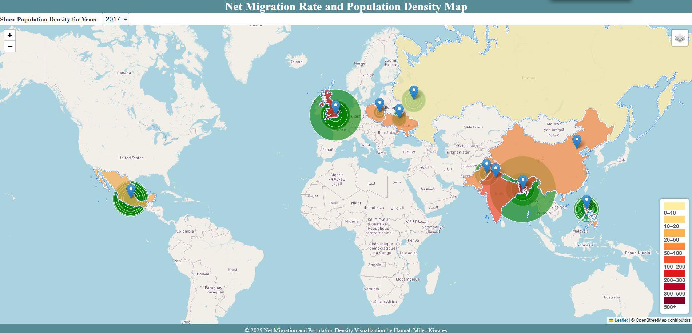
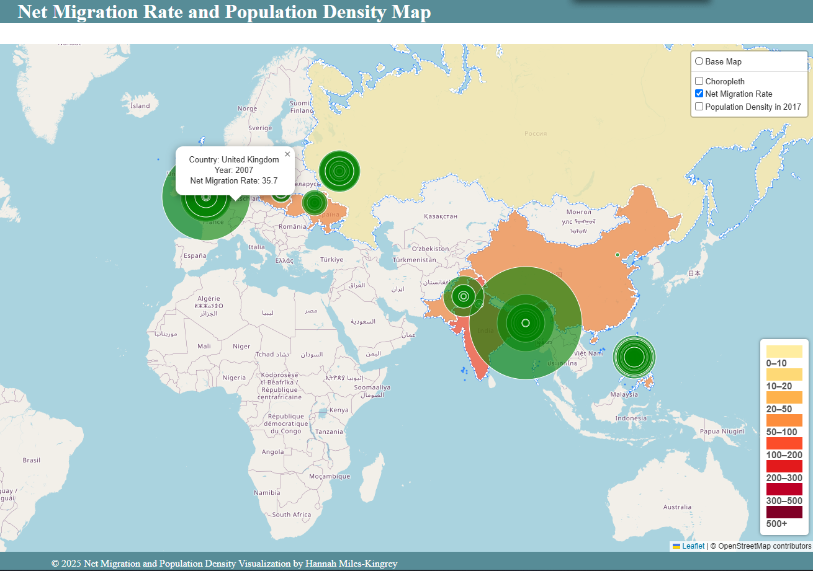
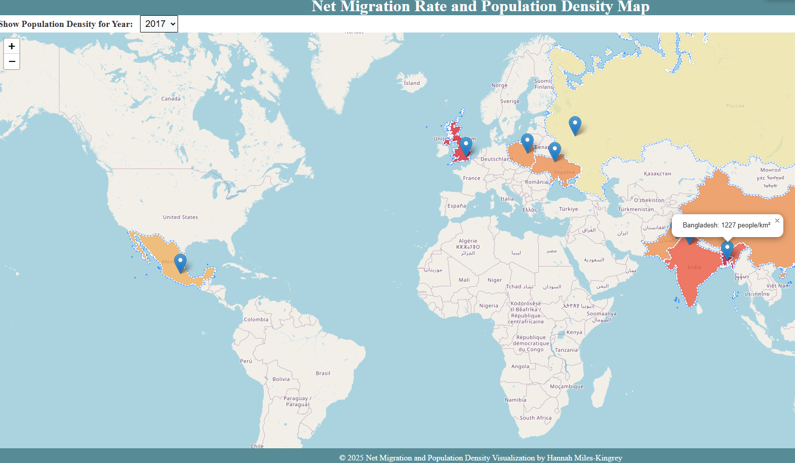

# data-class-project3

Team Members:
- Sezer Bozoglan
- Hannah Miles-Kingrey
- Nathaniel Trief

# Project Overview and Purpose
## Research Question and Terminology

*Is there a relationship between the population density of a country and its migration trends?*

We used a Kaggle dataset that gathered migration data from the World Bank for the years 1960-2018[^1]. We narrowed down our focus to 10 countries that were noted by the World Migration Report as having the highest numbers of emigrants in 2020.[^2]

**Net Migration Rate** is "[t]he difference between the number of migrants entering and those leaving a country in a year, per 1,000 midyear population. May also be expressed in percent. <ins> A positive figure is known as a net immigration rate and a negative figure as a net emigration rate</ins>". [^3]

- A formula for calculating the net migration rate is:
- N = (I - E) / M X 1,000
  - N = Net migration rate
  - I = Number of immigrants entering the area
  - E = Number of emigrants leaving the area
  - M = Mid-year population [^4]
    
Note: Our original dataset did not multiply the migration percentage by 1,000 (to reflect per 1,000 people) so that was a step added to the JavaScript.

**Population Density** is how many people live in a given area. Our data will be shown per square kilometer.

## Methodology and Tools
- JavaScript, Leaflet, HTML, CSS, Chart.js
- ETL:
  1. Downloaded and cleaned CSV to show ten countries with the highest rates of migration in 2020.
  2. Created JSON and GeoJSON files for migration percentage and population density.
  3. Created JavaScript and HTML files to run a Leaflet map.
  4. Used Chart.js to create line charts of net migration data.
  5. Loaded into MongoDB

## Results
<ins> Leaflet Map: Net Migration and Population Density </ins>

Overview

Net Migration Rates (Circle Markers)
- United Kingdom, 2007

Population Density (Choropleth and Tooltips)
- Bangladesh, 2017

- Dashboards

# Instructions 
<ins> Leaflet Map: Net Migration and Population Densit </ins>
1. Clone the repo.
2. Open index.html and logicv3a.js.
3. For migration data, click on various ring markers to show net migration rates for a given country.
4. For population density data, use the dropdown menu to select every 10 years from 1967-2017.

<ins> Net Migration Charts </ins>
1. Clone the repo.
2. Open index2.html and logicv5.js
3. OR open [GitHub Pages Link](Link name here)

### 1. Net Migration (1962-2017)
**Description:** Displays net migration trends for selected countries.
- **File Name:** [`Net_Migration_.png`](Images/Net_Migration_.png)

### 2. Population Density (1962-2017)
**Description:** Shows changes in population density (people per square kilometer) for selected countries.
- **File Name:** [`Population_Density.png`](Images/Population_Density.png)

### 3. Total Population (1962-2017)
**Description:** Visualizes total population growth over time for selected countries.
- **File Name:** [`Total_Populaton.png`](Images/Total_Populaton.png)

# Ethical Considerations
The World Bank terms of use allow for copying, distributing, adapting, displaying or including their data for commercial and noncommercial use at no cost under a Creative Commons Attribution 4.0 International License. Certain agreements are expected, including, clear attribution to World Bank and particular dataset name or source (if known).

# References and Attributions
[^1]: [Kaggle Dataset](https://www.kaggle.com/datasets/eliasdabbas/migration-data-worldbank-1960-2018)
[^2]: [World Migration Report](https://worldmigrationreport.iom.int/what-we-do/world-migration-report-2024-chapter-4/who-migrates-internationally-and-where-do-they-go-international-migration-globally-between-1995-2020)
[^3]: [(Census.gov)](https://www.census.gov/glossary/?term=Net+migration+rate)
[^4]: [(Wikipedia)](https://en.wikipedia.org/wiki/Net_migration_rate#:~:text=The%20net%20migration%20rate%20is,positive%20net%20migration%20rate%20occurs.)
